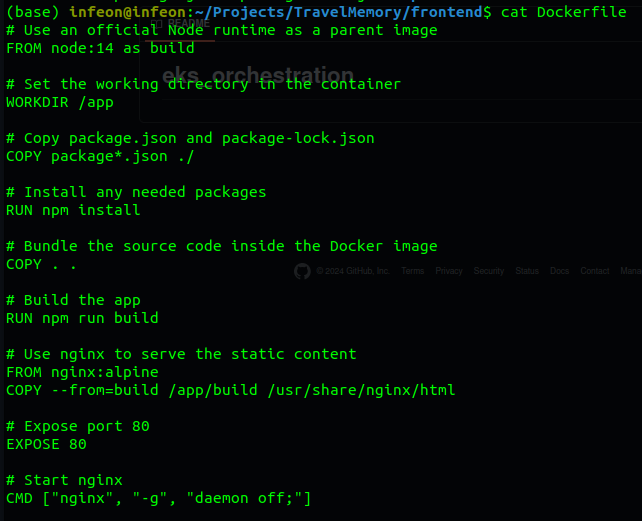
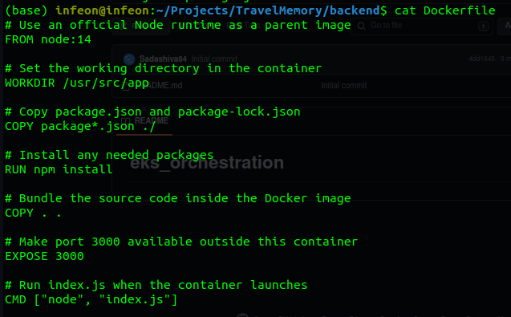

# Travel Memory
Description: This projects aims at deploying a simple Mern stack application.

Create the Dockerfile for the front-end


Create the Dockerfile for the back-end



`.env` file to work with the backend:

```
MONGO_URI='ENTER_YOUR_URL'
PORT=3000
```

Data format to be added: 

```json
{
    "tripName": "Incredible India",
    "startDateOfJourney": "19-03-2022",
    "endDateOfJourney": "27-03-2022",
    "nameOfHotels":"Hotel Namaste, Backpackers Club",
    "placesVisited":"Delhi, Kolkata, Chennai, Mumbai",
    "totalCost": 800000,
    "tripType": "leisure",
    "experience": "Lorem Ipsum, Lorem Ipsum,Lorem Ipsum,Lorem Ipsum,Lorem Ipsum,Lorem Ipsum,Lorem Ipsum,Lorem Ipsum,Lorem Ipsum,Lorem Ipsum,Lorem Ipsum,Lorem Ipsum,Lorem Ipsum,Lorem Ipsum,Lorem Ipsum,Lorem Ipsum,Lorem Ipsum,Lorem Ipsum,Lorem Ipsum,Lorem Ipsum,Lorem Ipsum,Lorem Ipsum,Lorem Ipsum,Lorem Ipsum,Lorem Ipsum,Lorem Ipsum,Lorem Ipsum, ",
    "image": "https://t3.ftcdn.net/jpg/03/04/85/26/360_F_304852693_nSOn9KvUgafgvZ6wM0CNaULYUa7xXBkA.jpg",
    "shortDescription":"India is a wonderful country with rich culture and good people.",
    "featured": true
}
```
